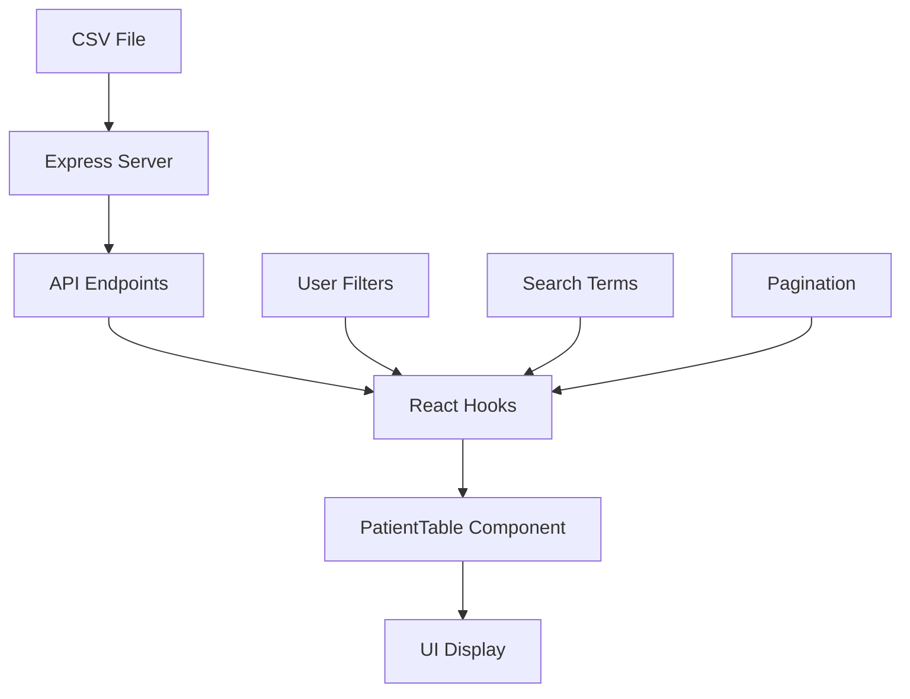

# 🏥 Integración de Datos CMBD en la Aplicación React

Este documento explica cómo usar los datos reales del CSV de pacientes CMBD en tu aplicación React de gestión de estadía.

## 🚀 Inicio Rápido

### 1. Iniciar el Servidor de Datos

```bash
# Opción 1: Usar el script automatizado
./start-server.sh

# Opción 2: Manual
cp server-package.json package.json
npm install
node server.js
```

### 2. Iniciar la Aplicación React

```bash
# En otra terminal
npm run dev
```

### 3. Usar los Datos CMBD

1. Abre la aplicación en el navegador
2. Haz clic en el botón **"Datos Ejemplo"** en el header
3. El botón cambiará a **"Datos CSV"** indicando que estás usando los datos reales
4. Ve a la pestaña **"Gestión de Pacientes"** para ver los 39,222 pacientes

## 📊 Características de la Integración

### ✅ Funcionalidades Implementadas

- **39,222 pacientes reales** del dataset CMBD
- **Búsqueda y filtrado** en tiempo real
- **Paginación** para manejar grandes volúmenes de datos
- **Estado del servidor** en tiempo real
- **Recarga de datos** desde el CSV
- **Información completa** de cada paciente
- **Estadísticas** actualizadas automáticamente

### 🔄 Alternancia entre Datos

- **Datos Ejemplo**: 6 pacientes de muestra para desarrollo
- **Datos CSV**: 39,222 pacientes reales del sistema CMBD

## 📡 API Endpoints

El servidor Express proporciona los siguientes endpoints:

### `GET /api/patients`
Obtiene pacientes con filtros y paginación.

**Parámetros:**
- `page`: Número de página (default: 1)
- `limit`: Elementos por página (default: 50)
- `search`: Búsqueda por nombre, RUT o diagnóstico
- `service`: Filtro por servicio clínico
- `risk`: Filtro por nivel de riesgo
- `status`: Filtro por estado
- `age_min`: Edad mínima
- `age_max`: Edad máxima

**Ejemplo:**
```
GET /api/patients?search=María&service=NEONATOLOGIA&page=1&limit=20
```

### `GET /api/stats`
Obtiene estadísticas generales del dataset.

**Respuesta:**
```json
{
  "total": 39222,
  "activos": 15000,
  "alta_pendiente": 5000,
  "dados_alta": 19222,
  "riesgo_verde": 20000,
  "riesgo_amarillo": 15000,
  "riesgo_rojo": 4222,
  "hombres": 16319,
  "mujeres": 22903,
  "servicios_unicos": 34,
  "edad_promedio": 45.2,
  "estancia_promedio": 8.5
}
```

### `GET /api/services`
Obtiene lista de servicios clínicos únicos.

### `POST /api/reload`
Recarga los datos desde el archivo CSV.

### `GET /api/health`
Verifica el estado del servidor.

## 🎯 Uso en la Aplicación

### Componente PatientTable

El componente `PatientTable` ahora soporta dos modos:

```tsx
// Modo datos locales (ejemplo)
<PatientTable
  patients={filteredPatients}
  onViewPatient={handleViewPatient}
  useAPIData={false}
/>

// Modo datos de API (CMBD)
<PatientTable
  onViewPatient={handleViewPatient}
  useAPIData={true}
  filters={{
    search: searchTerm,
    service: serviceFilter,
    risk: riskFilter,
    status: statusFilter
  }}
/>
```

### Hook usePatientsAPI

```tsx
import { usePatientsAPI } from './hooks/usePatientsAPI';

const { 
  patients, 
  loading, 
  error, 
  total,
  fetchPatients,
  reloadData 
} = usePatientsAPI();

// Cargar pacientes con filtros
fetchPatients({
  page: 1,
  limit: 50,
  search: 'María',
  service: 'NEONATOLOGIA'
});
```

## 🔧 Configuración

### Variables de Entorno

Crea un archivo `.env` en la raíz del proyecto:

```env
REACT_APP_API_URL=http://localhost:3001/api
```

### Puerto del Servidor

El servidor por defecto usa el puerto 3001. Para cambiarlo:

```bash
PORT=3002 node server.js
```

## 📈 Rendimiento

### Optimizaciones Implementadas

- **Paginación**: Máximo 50 pacientes por página
- **Cache**: Datos cargados una vez y mantenidos en memoria
- **Filtros del servidor**: Reducen la cantidad de datos transferidos
- **Lazy loading**: Los datos se cargan solo cuando se necesitan

### Recomendaciones

- Para datasets más grandes (>100k registros), considera implementar:
  - Base de datos (PostgreSQL, MongoDB)
  - Índices en campos de búsqueda frecuente
  - Cache con Redis
  - Compresión de respuestas

## 🐛 Solución de Problemas

### Error: "Servidor desconectado"

1. Verifica que el servidor esté ejecutándose:
   ```bash
   curl http://localhost:3001/api/health
   ```

2. Revisa que el archivo CSV esté en el directorio correcto

3. Verifica que el puerto 3001 esté disponible

### Error: "Archivo CSV no encontrado"

1. Asegúrate de que el archivo `GRD 2024-Agosto 2025(Egresos 2024-2025)_con_datos.csv` esté en la raíz del proyecto

2. Verifica los permisos de lectura del archivo

### Datos no se actualizan

1. Usa el botón **"Recargar"** en la tabla de pacientes

2. O ejecuta:
   ```bash
   curl -X POST http://localhost:3001/api/reload
   ```

## 🔄 Flujo de Datos



## 📝 Notas Importantes

- Los datos están **anonimizados** con nombres y RUTs generados
- El sistema preserva la **estructura original** del CSV
- Las **fechas** se convierten automáticamente al formato ISO
- Los **niveles de riesgo** se calculan basándose en los datos GRD
- El **estado del paciente** se determina por las fechas de ingreso/egreso

## 🚀 Próximos Pasos

1. **Base de datos**: Migrar a una base de datos real
2. **Autenticación**: Agregar sistema de usuarios
3. **Notificaciones**: Alertas en tiempo real
4. **Reportes**: Generación de reportes PDF/Excel
5. **Mobile**: Versión móvil de la aplicación

## 📞 Soporte

Para problemas o dudas:
1. Revisa los logs del servidor en la consola
2. Verifica la consola del navegador para errores
3. Usa el endpoint `/api/health` para diagnosticar el servidor
4. Consulta este README para soluciones comunes
